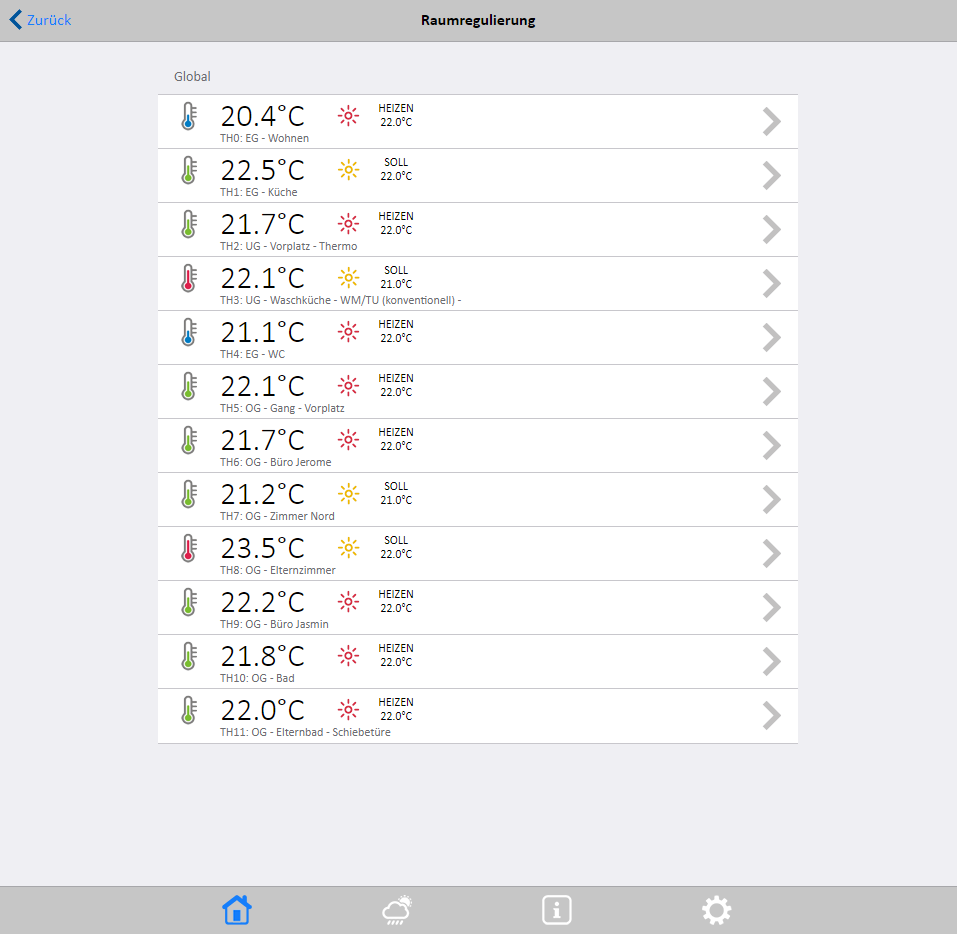
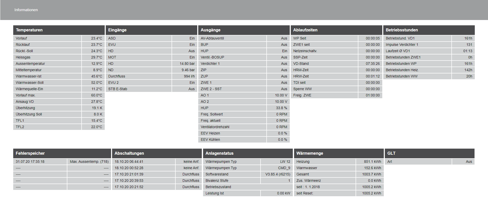

# JJSmartHome

Read measurements from innoxel weather station over soap and write it
into influxdb to be visualized in grafana. Also read measurements from
heatpump Alpha Innotec. It is done with
[Selenium](https://www.selenium.dev/) .

## Requirements
The following python packages are required:
- Selenium
- Influxdb
- BeautifulSoup4
- ...

## Dependencies

The following dependencies must be fulfiled:

- chromium-chromedriver_65.0.3325.181-0ubuntu0.14.04.1_armhf.deb
  Required version can be downloaded from :
  [https://launchpad.net/ubuntu/trusty/armhf/chromium-chromedriver/65.0.3325.181-0ubuntu0.14.04.1](https://launchpad.net/ubuntu/trusty/armhf/chromium-chromedriver/65.0.3325.181-0ubuntu0.14.04.1)
  Must be started manually before script is executed

## Cron Job

Execution of different python scripts is handled with
[Cron Job](https://github.com/jeromefischer/jjsmarthome/blob/master/crontab)

> */5 * * * * python3 /home/pi/innoxel/innoxel_weather.py
>
> */10 * * * * python3 /home/pi/innoxel/innoxel_room_temperatures.py
>
> @reboot /usr/lib/chromium-browser/chromedriver
>
> PATH=/usr/bin:/usr/lib/:/usr/lib/chromium-browser
>
> */5 * * * * DISPLAY=:0 /usr/bin/python3 /home/pi/innoxel/heatpump.py >> out.txt 2>&1

## Innoxel Smart Home
The [Innoxel Master 3](https://www.zidatech.ch/de/innoxel-master-3-zentrale-steuerungseinheit.html) provides several interfaces for data exchange.
SOAP is used to read weather station data and room temperatures.

## Heatpump
Alpha Innotec Heatpump provides a webserver, where several data are available. To access this measurements, Selenumu is used to establish connection, read values, parse desired measurements and write it to influxDB.

## InfluxDB

## Grafana

